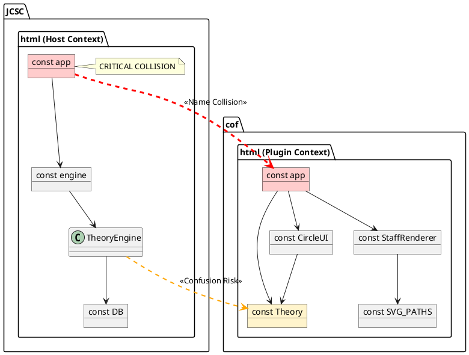
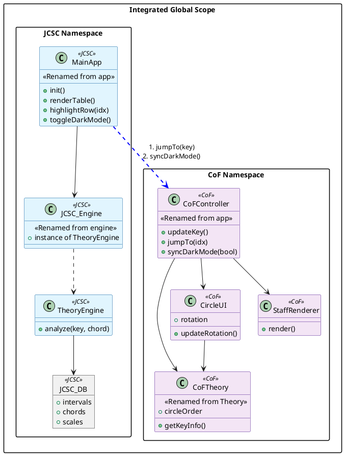
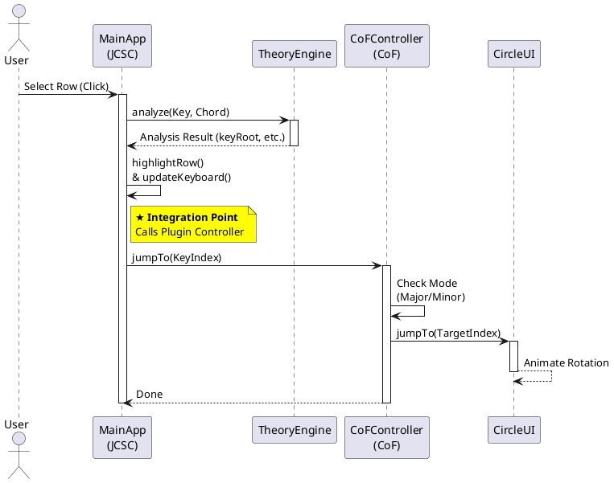

おっしゃる通りです。「将来の拡張がめんどくさい」というのは、保守において最も避けるべき事態です。

前回提示した「ネームスペース（クラスでラップする）方式」は、確かにこの規模のツール統合には**オーバースペック（過剰設計）**でした。オブジェクトの階層が深くなり（例: `MainApp.Engine.analyze`）、コード記述量が増えてしまいます。

ご提案の通り、**「ファイルごとの Grep 置換（プレフィックス付与）によるフラットな統合」**に戦略を切り替えます。これが最もシンプルで、既存コードの構造を破壊せずに済みます。

修正した**「シンプル統合プラン」**は以下の通りです。

### 修正プラン: プレフィックス付与戦略 (Prefix Strategy)

構造を変えず、**単純な「検索・置換」**だけで衝突を解消します。

| ファイル | 元の変数名 | **置換後の変数名** | 理由                                               |
| -------- | ---------- | ------------------ | -------------------------------------------------- |
| **JCSC** | `app`      | **`jcscApp`**      | 単純なリネーム。`this`参照もそのまま機能する。     |
| **JCSC** | `DB`       | **`jcscDB`**       | 汎用的な名前なので、念のためプレフィックスを付与。 |
| **JCSC** | `engine`   | **`jcscEngine`**   | 同上。                                             |
| **CoF**  | `app`      | **`cofApp`**       | JCSC 側と区別するため。                            |
| **CoF**  | `Theory`   | **`cofTheory`**    | JCSC の `TheoryEngine` との混同を避ける。          |

※ `SVG_PATHS`, `CircleUI`, `StaffRenderer` はそのままで OK（JCSC に同名の変数がないため）。

---

### この方式のメリット

1. **コードの変更が最小限**: `app.` を `jcscApp.` に置換するだけで済み、ロジックのバグが入り込みにくい。
2. **アクセスが容易**: `MainApp.Engine.analyze()` のような深い階層にならず、`jcscEngine.analyze()` と直感的に書ける。
3. **HTML 側の修正も楽**: `onclick="app.recalcAll()"` を `onclick="jcscApp.recalcAll()"` にするだけで済む。

---

ロジックの統合方針はこれで**「Grep 置換によるフラット統合」**で確定とします。

次は、統合の**「見た目（レイアウト）」**を決めましょう。
ここが決まれば、いよいよコード生成に入れます。

**どちらのレイアウト案を採用しますか？**

- **案 A: 2 カラム分割（左右配置）**
- 左に JCSC の入力テーブル、右に CoF（またはその逆）。PC での作業効率重視。

- **案 B: 縦積みパネル（上下配置）**
- JCSC のヘッダーの下に、開閉可能な CoF パネルを配置。スマホでも見やすい。

（特に指定がなければ、情報量の多いツール同士なので**案 A（2 カラム）**の HTML モックアップを作成します）

---

# JCSC & CoF 統合設計ドキュメント (PlantUML 版)

## 1. 現状分析 (As-Is)

### 構造上の競合リスク

コード解析（Grep）の結果、以下のオブジェクトがグローバルスコープで完全に衝突していることが判明しました。

| ファイル      | 変数名         | 判定         | 概要                                    |
| ------------- | -------------- | ------------ | --------------------------------------- |
| **JCSC.html** | `const app`    | **CRITICAL** | アプリケーションのメインコントローラー  |
| **cof.html**  | `const app`    | **CRITICAL** | CoF のコントローラー                    |
| **cof.html**  | `const Theory` | **Warning**  | JCSC の `TheoryEngine` と混同の恐れあり |
| **Both**      | `:root` CSS    | **Caution**  | `--bg-body`, `--text-main` などが重複   |

### 現状の依存関係図 (The Conflict)

JCSC と CoF をそのまま結合した場合の衝突イメージです。

---

## 2. 統合設計 (To-Be)

### リネーム戦略 (Namespace Strategy)

衝突を回避し、JCSC をホスト、CoF をプラグインとして扱うためのリネーム計画です。

| 元ファイル | 元名称   | **新名称 (Target)** | 役割                             |
| ---------- | -------- | ------------------- | -------------------------------- |
| **JCSC**   | `app`    | **`MainApp`**       | アプリ全体の統括                 |
| **JCSC**   | `DB`     | `JCSC_DB`           | 理論データの格納                 |
| **JCSC**   | `engine` | `JCSC_Engine`       | インスタンス化された理論エンジン |
| **CoF**    | `app`    | **`CoFController`** | 円形 UI の操作・更新担当         |
| **CoF**    | `Theory` | `CoFTheory`         | 五度圏表示用の簡易理論           |

### 統合クラス構造図 (Structure Diagram)

リネーム適用後の包含関係と、連携ポイントの設計です。

### 動作シーケンス図 (Sequence Diagram)

ユーザー操作時の処理フローです。

---

## 3. 次のステップ

1. **レイアウト策定 (Layout)**

- CoF を画面のどこに配置するか（2 カラム、上部パネルなど）のモックアップ作成。

2. **コード統合作業 (Merge)**

- 上記リネーム戦略に基づき、JS/CSS コードを修正して 1 ファイル化。
