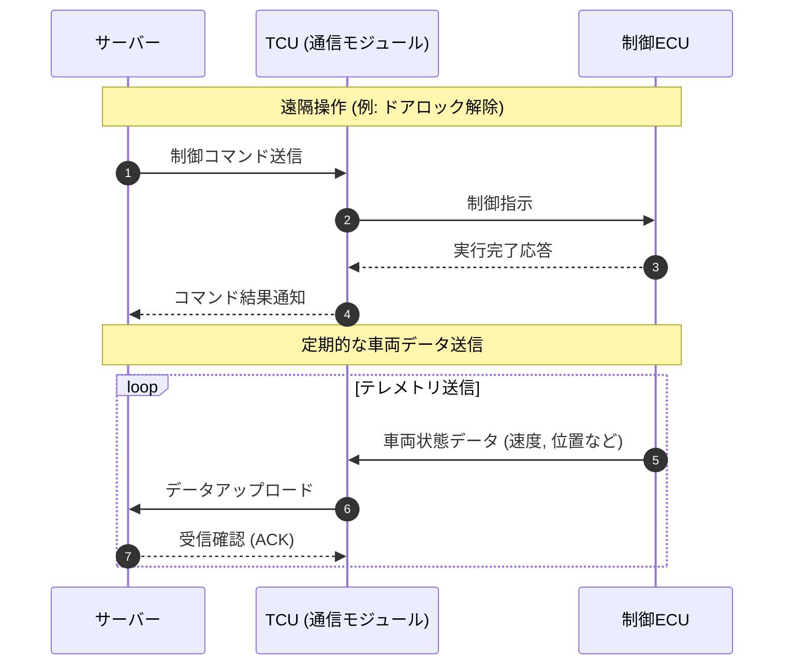

Gemini
チャットを新規作成
チャットを検索
ライブラリ
ノートブックを新規作成
Untitled notebook
ダミーTSVファイル作成とGitHub確認
車載SWトレーサビリティ管理ツール比較
ARC-AGI-3 解決ループの和訳と確認
ARC-AGI-3 攻略レポートと戦略
ARC-AGI-3にチャレンジする。 以下の資料をA4用紙10枚程度の情報量で要約し、下記MCBSMDの形式でレポートせよ。 ポイントはARC-AGI-3に勝つための前提条件、考察、コツなどだ。 ## Output Format - Output the entire content **as a single Markdown code block** so it can be copied in one go. - **Enclose the entire Markdown with six backticks ` `````` ` at the beginning and end.** Specify its language as markdown. - **Use these six backticks only once as the outermost enclosure.** - **Never output speculation or fabrications.** If something is unclear or requires investigation, explicitly state so. - This method is called **MCBSMD** (Multiple Code Blocks in a Single Markdown) ### Code and Diagram Block Rules - As a rule, use Mermaid for diagrams. Use PlantUML only when the diagram cannot be expressed in Mermaid. - Any diagrams or software code inside the Markdown must each be enclosed in their own code blocks using triple backticks ` ``` `. - Each code block must specify a language or file type (e.g., ` ```python ` or ` ```mermaid `). - Each code or diagram block must be preceded by a descriptive title in the format **title:** (e.g., `**System Architecture:**`, `**Login Flow:**`) - Always follow the structure below for every code or diagram block: > **title:** > > `language   > (code or diagram content here without truncation or abbreviation)   > ` > > Write the explanation for the code block here, immediately after the block, following a blank line. - Do not write explanations inside the code blocks. - In all diagrams, prefer alphanumeric characters and underscores (`_`); non-ASCII text (no spaces) is allowed only when non-English is more appropriate for the diagram. Special symbols (e.g., `\`, `/`, `|`, `<`, `>`, `{`, `}`) are strictly prohibited. - Output all diagram content without omission. Never use `...` or any shorthand. ### Diagram Label and Notation Rules - All arrows and relationship lines in diagrams MUST have labels. Follow these notation rules: 1. Mermaid `flowchart` and `graph`: place the label inside the arrow using pipes (e.g., `A -->|Label| B`) 2. Other Mermaid diagrams / All PlantUML: place the label after the arrow using a colon (e.g., `A --> B : Label`) - For line breaks in labels or node text: 1. Mermaid: use `<br/>` inside a quoted string (e.g., `A -->|"Line1<br/>Line2"| B`, `A["Line1<br/>Line2"]`) 2. PlantUML: use `\n` (e.g., `A -> B : Line1\nLine2`) ### Math Rules - Use standard LaTeX notation for all mathematical formulas. 1. Inline math: always use single dollar signs. Place a space before the opening `$` and a space after the closing `$` (e.g., `The function is $y = x + 1$ here.`) 2. Block equations: always place `$$` on its own line, above and below the formula. Example: > $$ > E = mc^2 > $$
ARC-AGI-3 技術レポート和訳作成
ARC-AGI-3: 適応力と学習速度の勝負
LLMの理解の仕組みを解説
Obsidian Canvas グループ透明化方法
OpenClaw Engine Report
OpenCrowに関する情報不足
競合分析（Competitive Review）とは
Obsidian Canvas 機能と活用法
わかり まし た 。 はい 。 はい 。
StrictDocのライセンス形態について
Polarion Jobs の場所とアクセス方法
PolarionからReqIFへのエクスポート方法
Polarion ALMとPolarion Xの違い
PolarionへのAI活用による要件登録
無料トライアルの利用方法
Polarion データ構造仕様書について
YouTube Premium Liteとは？有料？
聞こえていますか？何かお手伝いしましょうか？
応答とサポートの提供
通話確認と用件
温泉から高根沢町へのドライブコース
iQUAVISのグローバル展開と活用
Can You Hear Me?
イーロン・マスクの年齢
Claudeとdraw.ioの連携機能
洗濯機リサイクル費用と処分方法
「召使」という言葉の歴史
ウェッジロッキングワッシャーの発明と特許
Voice Test Successful
20代コンサルの存在意義とは
bs-16i向けSoundFontおすすめ紹介
Gemini との会話
ダミーのTSVファイルを書いて。

テスト結果表が良い。

, もセル内に入れて。 , csvよりTSVが良いことを表現したい。

あと <br />もいれて。 GitHubのブラウザでどう見えるか確認したい。

ご指定のTSVファイルが準備できました。
TSV のアイコン
test_results_sample
TSV

ご要望に合わせて、以下の要素を盛り込んだテスト結果表を作成しました。

セル内のカンマ（,）
氏名（例: 山田, 太郎）やフィードバック文の中にカンマ（読点代わり）を含めています。
CSV（カンマ区切り）の場合、セル内にカンマが存在するとデータがそこで区切られてしまうため、文字列全体をダブルクォーテーションで囲む（エスケープする）などの処理が必要になります。一方、TSV（タブ区切り）であれば、カンマは単なる文字として扱われるため、エスケープなしでそのまま扱うことができ、データ破損やパース処理の複雑化を防げるというメリットがあります。

HTMLの改行タグ（<br />）
右端の「フィードバック・備考」列の文章内に <br /> を挿入しました。GitHubはリポジトリ上のTSVファイルを自動的にテーブルとしてリッチ表示する機能がありますが、そこでHTMLタグがエスケープされるか、実際に改行としてレンダリングされるかをブラウザ上でテストしていただけます。

ファイルをダウンロード後、GitHubのリポジトリにプッシュして実際の見え方をご確認ください。

じゃ、つぎ。 drawioでシステム構成図を書いて。

車とサーバー群、スマホが通信するのが良い。

車の中には複数のECUがつながっているの。

はい、次ですね！お任せください。

AIの仕様上、直接 .drawio ファイルを生成することはできないのですが、draw.ioにコピペするだけで一瞬でシステム構成図に変換されるコード（Mermaid記法）をご用意しました。

以下の手順でdraw.ioに読み込ませてみてください。

🛠️ draw.ioでの使い方
draw.io (diagrams.net) を開く。

上部メニューから 「配置 (Arrange)」 ＞ 「挿入 (Insert)」 ＞ 「高度な機能 (Advanced)」 ＞ 「Mermaid...」 をクリック。

出てきたテキストボックスに、以下のコードをすべて貼り付けて 「挿入 (Insert)」 をクリック。

コード スニペット
graph TD
%% スタイリング
classDef cloud fill:#e3f2fd,stroke:#2196f3,stroke-width:2px;
classDef car fill:#e8f5e9,stroke:#4caf50,stroke-width:2px;
classDef ecu fill:#c8e6c9,stroke:#388e3c,stroke-width:1px;
classDef mobile fill:#fff3e0,stroke:#ff9800,stroke-width:2px;

    %% モバイル（スマホ）
    subgraph Mobile["スマートフォン"]
        App["専用アプリ"]:::mobile
    end

    %% クラウドサーバー群
    subgraph Cloud["クラウドサーバー群"]
        API["APIサーバー"]:::cloud
        DB[("データベース")]:::cloud
        IoT["IoTゲートウェイ (MQTT)"]:::cloud
    end

    %% 車両
    subgraph Car["コネクテッドカー"]
        TCU["TCU (通信モジュール)"]:::car
        GW["セントラルゲートウェイ"]:::car

        subgraph InVehicleNetwork["車内ネットワーク (CAN / Ethernet)"]
            ECU1["エンジン制御 ECU"]:::ecu
            ECU2["ブレーキ制御 ECU"]:::ecu
            ECU3["インフォテインメント ECU"]:::ecu
            ECU4["ボディ制御 ECU"]:::ecu
        end

        %% 車内ネットワークの接続
        TCU <--> GW
        GW <--> ECU1
        GW <--> ECU2
        GW <--> ECU3
        GW <--> ECU4
    end

    %% 通信経路
    App <-->|HTTPS / WebSocket| API
    API <--> DB
    API <--> IoT
    IoT <-->|4G / 5G通信| TCU
    App -.->|Bluetooth / UWB (近距離直接通信)| TCU

💡 構成図のポイント
車の中のネットワーク: 外部通信を担当する「TCU（通信モジュール）」から「ゲートウェイ」を経由して、各ECU（エンジン、ブレーキなど）が安全に繋がる一般的なコネクテッドカーの構成にしています。

サーバー群: スマホからのリクエストを受け付ける「APIサーバー」と、車と常時接続してデータをやり取りする「IoTゲートウェイ（MQTTなど）」を分けて構成しました。

通信経路: 基本はクラウド経由ですが、スマホをデジタルキーとして使うようなケースを想定して、スマホと車の「直接通信（Bluetooth等）」も点線で表現しています。

draw.ioに取り込んだ後は、ブロックの色を変えたり、矢印を動かしたりと自由に編集できます。ぜひお試しください！

文法エラーだよ。 公式なMermaidに従って。

:: の数とか合ってる？ 特殊文字とか、コメントも要らんよ。

失礼しました。ご指摘ありがとうございます。

draw.ioに組み込まれているMermaidのバージョンや環境によっては、クラス指定用の :::（コロン3つ）や、コメント行（%%）、テキスト付きの双方向矢印などが構文エラー（Syntax Error）の引き金になることがあります。

余計な装飾、コメント、特殊文字をすべて排除し、最もシンプルで確実な公式構文のみに書き直しました。こちらをお試しください。

コード スニペット
graph TD
subgraph Mobile
App["スマートフォンアプリ"]
end

    subgraph Cloud
        API["APIサーバー"]
        DB[("データベース")]
        IoT["IoTゲートウェイ"]
    end

    subgraph Car
        TCU["TCU 通信モジュール"]
        GW["セントラルゲートウェイ"]

        subgraph InVehicleNetwork
            ECU1["エンジン制御ECU"]
            ECU2["ブレーキ制御ECU"]
            ECU3["インフォテインメントECU"]
            ECU4["ボディ制御ECU"]
        end

        TCU --- GW
        GW --- ECU1
        GW --- ECU2
        GW --- ECU3
        GW --- ECU4
    end

    App -->|HTTPS| API
    API --- DB
    API --- IoT
    IoT -->|4G 5G| TCU
    TCU -->|4G 5G| IoT
    App -.->|Bluetooth| TCU

じゃ、 Markdownで適当なレポートを書いて。

Markdownの中で、./test_results_sample.tsv と ./システム図.svg を入れて。 GitHubのブラウザでどう見えるか確認したい。

ご指定のMarkdownファイルが準備できました。
MD のアイコン
dummy_report
MD

GitHubのブラウザでの見え方を確認しやすいよう、以下のように記述を盛り込んでいます。

SVGの読み込み ()
Markdownの標準的な画像記法です。GitHubでは、同じ階層に システム図.svg を置いておけば、この部分にシステム構成図がそのまま画像として埋め込まれて表示されます。（先ほどのdraw.ioの図をSVGとしてエクスポートし、同じ名前にして一緒にアップロードしてください）

TSVへのリンク ([テスト結果データ (TSV)](./test_results_sample.tsv))
Markdown内でTSVファイルを直接テーブルとして展開することはできないため、リンクとして配置しています。GitHub上では、このリンクをクリックしてTSVファイルの画面に飛ぶと、自動的にキレイな表組み（リッチテーブル）としてパースされて表示されます。

生成したTSVファイル、エクスポートしたSVGファイル、そしてこのMarkdownファイルの3つを同じディレクトリに入れてGitHubにプッシュし、ぜひ実際の見え方をご確認ください！

Mermaidでシーケンス図を書いて。 さーバーと車両が通信する奴。

サーバーと車両（コネクテッドカー）が通信するシーケンス図を作成しました。

先ほどと同様に、構文エラーの原因になりやすい特殊な装飾やコメントを省き、標準的なMermaid構文のみでシンプルに記述しています。

🚗 サーバーと車両の通信シーケンス図
コード スニペット
sequenceDiagram
autonumber
participant Server as サーバー
participant TCU as TCU (通信モジュール)
participant ECU as 制御ECU

    Note over Server,ECU: 遠隔操作 (例: ドアロック解除)
    Server->>TCU: 制御コマンド送信
    TCU->>ECU: 制御指示
    ECU-->>TCU: 実行完了応答
    TCU-->>Server: コマンド結果通知

    Note over Server,ECU: 定期的な車両データ送信
    loop テレメトリ送信
        ECU->>TCU: 車両状態データ (速度, 位置など)
        TCU->>Server: データアップロード
        Server-->>TCU: 受信確認 (ACK)
    end

💡 処理の流れ（ポイント）
参加要素（Participant）: クラウド側の「サーバー」、車両側の通信窓口である「TCU」、そして実際の車載機器を動かす「制御ECU」の3つを定義しています。

遠隔操作（上部）: サーバー起点で車両を操作する流れです。TCUがコマンドを受け取り、対象のECUに実行させ、その結果をサーバーに返すまでを表現しています。

定期送信（下部）: 車両起点でサーバーへデータを送る流れです。速度や位置情報などのテレメトリデータを定期的にアップロードし続ける処理を loop 構文を使って表現しています。

こちらもそのままdraw.ioのMermaid挿入機能や、GitHubのMarkdownファイルに貼り付けてレンダリングを確認してみてください。

Gemini は AI であり、間違えることがあります。

# システム連携テストレポート

## 1. 概要

本レポートは、コネクテッドカーとクラウドサーバー間の通信システム、およびダミーのテスト結果をまとめたものです。
GitHub上での各ファイルのレンダリング（見え方）を確認するためのサンプルとして作成されています。

## 2. システム構成図

以下の図は、車載ECU、通信モジュール、およびクラウドサーバー群の連携を示したシステムアーキテクチャです。


_※ SVGファイルは、GitHubのMarkdownプレビューにおいて直接画像としてインライン表示されるはずです。_

## 3. テスト結果データ

各テストの評価およびフィードバックについては、以下のTSVファイルに記載されています。
セル内に含まれるカンマ（`,`）やHTMLの改行タグ（`<br />`）がどのように処理されるか確認してください。

[テスト結果データ (TSV)](./test_results_sample.tsv)

_※ Markdown上ではリンクとして表示されます。GitHub上でこのリンクをクリックしてTSVファイルのページに遷移すると、自動的にリッチなテーブル形式でレンダリングされます。_

---



**確認用メモ**:

- `システム図.svg` はリポジトリ内の同じディレクトリに配置してください（draw.io等からSVG形式でエクスポートして保存してください）。
- `test_results_sample.tsv` も同じディレクトリに配置してください。
  dummy_report.md
  「dummy_report.md」を表示しています。
