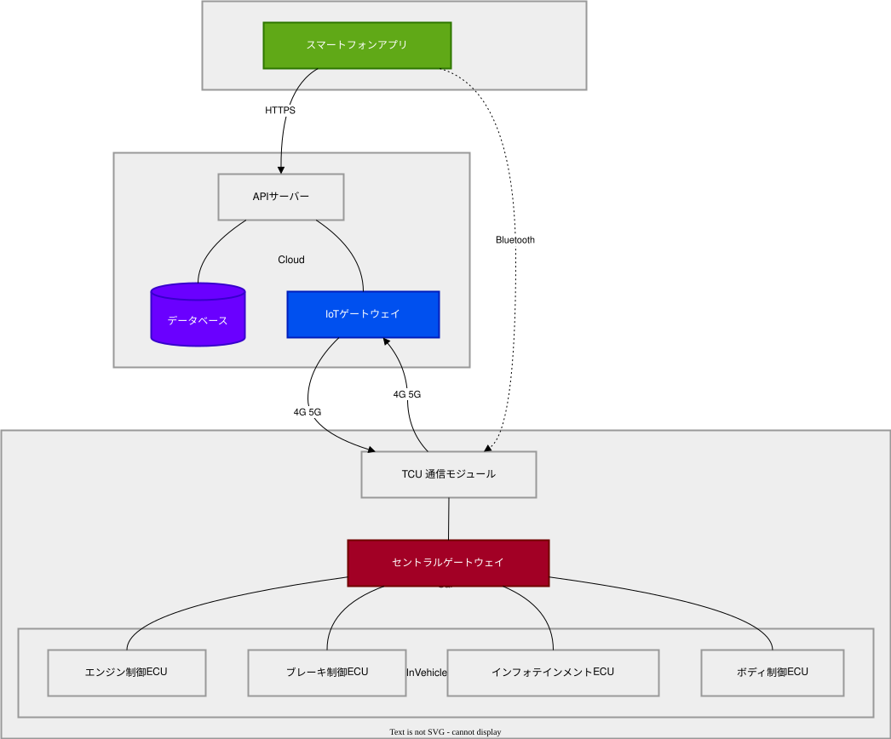
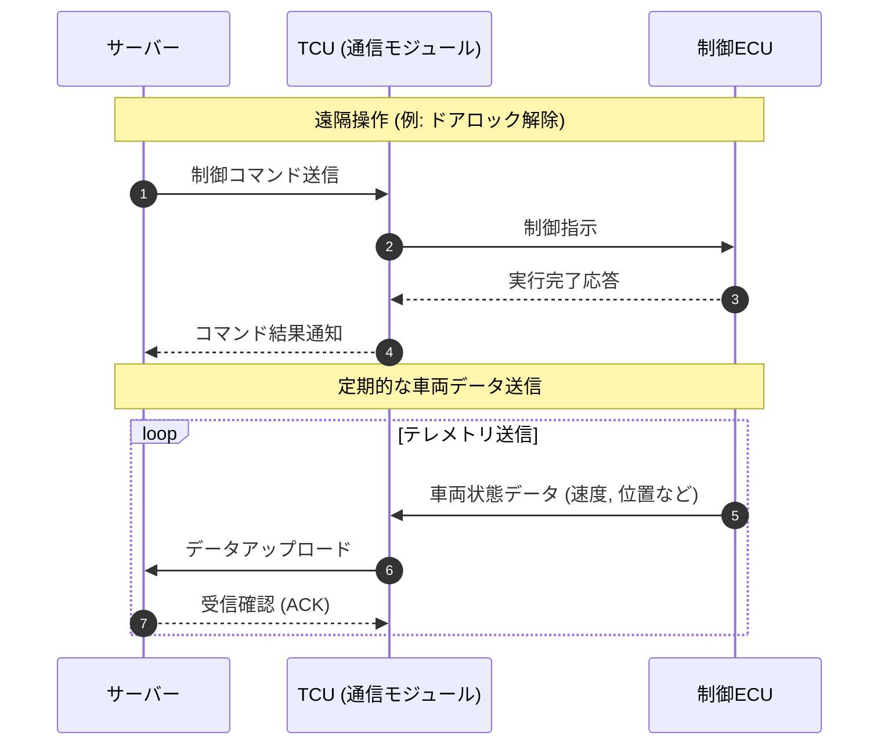

# システム連携テストレポート

## 1. 概要

本レポートは、コネクテッドカーとクラウドサーバー間の通信システム、およびダミーのテスト結果をまとめたものです。
GitHub上での各ファイルのレンダリング（見え方）を確認するためのサンプルとして作成されています。

## 2. システム構成図

以下の図は、車載ECU、通信モジュール、およびクラウドサーバー群の連携を示したシステムアーキテクチャです。

_※ SVGファイルは、GitHubのMarkdownプレビューにおいて直接画像としてインライン表示されるはずです。_

## 3. テスト結果データ

各テストの評価およびフィードバックについては、以下のTSVファイルに記載されています。
セル内に含まれるカンマ（`,`）やHTMLの改行タグ（` `）がどのように処理されるか確認してください。

[テスト結果データ (TSV)](./test_results_sample.tsv)

_※ Markdown上ではリンクとして表示されます。GitHub上でこのリンクをクリックしてTSVファイルのページに遷移すると、自動的にリッチなテーブル形式でレンダリングされます。_

---

**確認用メモ**:

- `システム図.svg` はリポジトリ内の同じディレクトリに配置してください（draw.io等からSVG形式でエクスポートして保存してください）。
- `test_results_sample.tsv` も同じディレクトリに配置してください。
  dummy_report.md
  「dummy_report.md」を表示しています。
